# Springboot协同过滤算法个性化音乐推荐系统

#### 介绍
springboot+vue前后端分离协同过滤算法个性化音乐推荐系统，爬虫（网易云），可视化数据分析，用户未登录：基于流行度的热点推荐，推荐平均分最高的音乐；用户已登录：基于用户的协同过滤推荐算法，用户音乐评分数据，如果没有推荐结果（冷启动和数据稀疏性），基于流行度的热点推荐。猜你喜欢推荐：推荐当前音乐类型下的音乐，同时过滤当前音乐和当前登录用户已浏览的音乐。

#### 项目说明
从零开发springboot+vue.js前后端分离简单在线音乐推荐系统项目实战 个性化音乐/网易云音乐/在线听歌推荐系统设计与开发 机器学习 深度学习 基于协同过滤推荐算法 爬虫 可视化大屏 SimpleMusicRecSys
#### 一、项目简介
#### 1、开发工具和使用技术
idea集成开发工具，nodejs18.0及以上版本，jdk1.8，maven依赖管理工具，mysql5.7及以上版本，navicat数据库管理工具，springboot后端框架，vue3前端框架，vue-router路由组件，pinia状态管理组件，element plus组件，echarts可视化图表组件等。

#### 2、实现功能
用户首页：http://localhost:5173/
管理员首页：http://localhost:5173/admin
管理员账号：admin 管理员密码：admin

前台用户功能：登录、注册、忘记密码、音乐搜索、音乐排序、流行度热点推荐、为你推荐（协同过滤）、猜你喜欢推荐、音乐评分、音乐播放、浏览历史、修改信息、修改密码等；
后台管理员功能：登录、数据分析、音乐管理、音乐类型管理、用户管理、评分管理、浏览历史管理、管理员管理等。

 **首页为你推荐：
用户未登录：基于流行度的热点推荐，推荐平均分最高的音乐；
用户已登录：基于用户的协同过滤推荐算法，用户音乐评分数据，如果没有推荐结果（冷启动和数据稀疏性），基于流行度的热点推荐。

音乐猜你喜欢推荐：
推荐当前音乐类型下的音乐，同时过滤当前音乐和当前登录用户已浏览的音乐。

可视化数据分析：饼状图、柱状图。

音乐数据：爬取网易云音乐网站的音乐数据。** 

#### 3、开发步骤

#### 一、需求分析

主要是分析需要实现的功能、确定开发工具及技术等。例如：前台用户需要有登录、注册、退出登录、搜索音乐、音乐评分、个性化推荐等，后台管理员需要有登录、用户管理、音乐管理、音乐类型管理等。springboot后端框架、vue前端框架、mysql数据库技术的选择等。

#### 二、数据库设计

数据库设计使用navicat数据库管理工具，可通过sql语句脚本生成数据库表，也可以直接操作新建表设计表等。注意主外键关联设计，例如：评分记录表需要外键关联用户表和音乐表。

#### 三、前端vue框架搭建

在cmd中使用nodejs命令：node create vue@latest，可快速创建一个vue框架项目，同时使用了vue-router路由插件、pinia状态管理插件、axios数据请求插件、echarts可视化插件和element plus等插件，其中element plus的ui组件用于设计html页面。

#### 四、后端springboot框架搭建

springboot是spring家族中的一个全新框架，用来简化spring程序的创建和开发过程。在以往我们通过SpringMVC+Spring+Mybatis框架进行开发的时候，我们需要配置web.xml、spring配置、mybatis配置，然后整合在一起，而springboot抛弃了繁琐的xml配置过程，采用大量默认的配置来简化我们的spring开发过程。
SpringBoot化繁为简，使开发变得更加的简单迅速。
使用idea集成开发工具同时开发springboot后端系统和vue前端系统。
使用nodejs创建一个vue3项目，然后使用idea打开，接着配置router路由导航、axios后端数据请求、element plus的ui组件，最后是具体页面的实现。
使用idea创建一个maven项目，然后在pom.xml中配置springboot框架开发依赖（spring、springmvc、mybatis等），接着就是创建controller、service、mapper、entity等，最后就是具体功能的实现。

#### 五、功能开发

具体功能的实现，商业项目开发时，前后端由不同的开发人员实现，并根据开发文档实现数据接口处理，一般的项目可以是设计一个前端页面同时实现一个后端数据接口。首先是进行前台用户首页的开发，其次是音乐详情，然后是用户注册、登录等，接着是用户的评分、修改信息等，然后是进行管理员功能的开发，最后是进行前台用户的个性化推荐功能实现。

#### 六、系统测试

主要是进行bug修改，推荐算法测试。

#### 二、项目展示

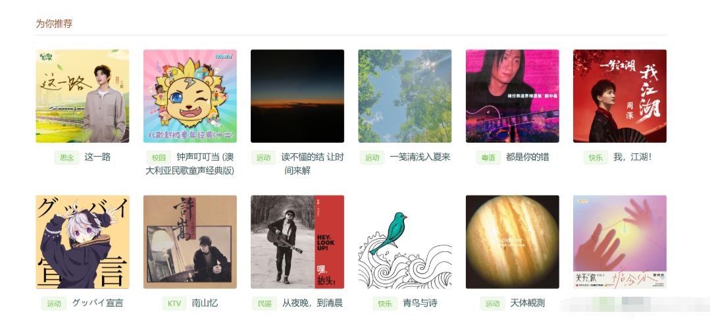
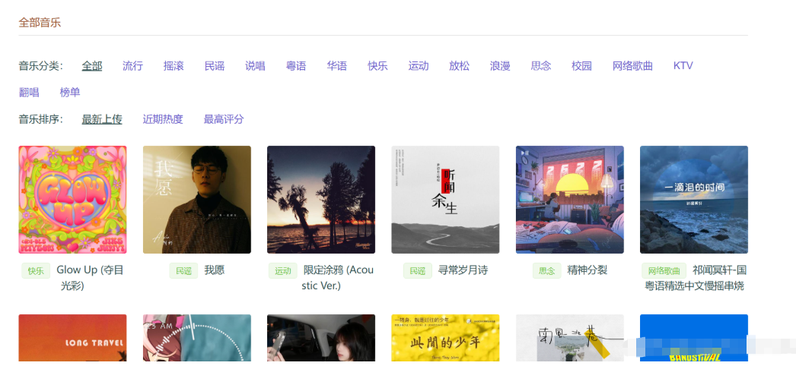
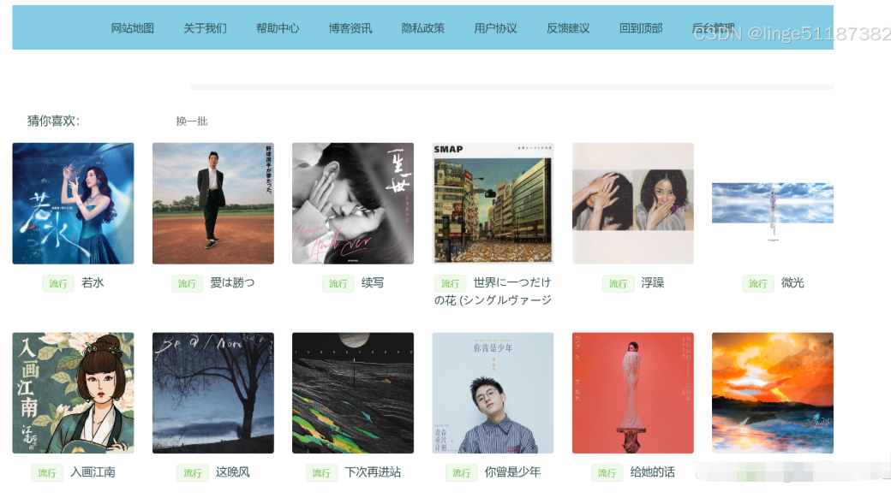
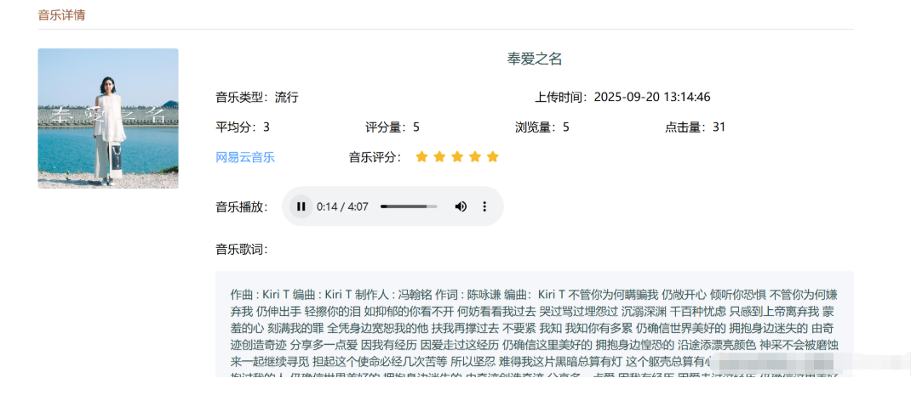

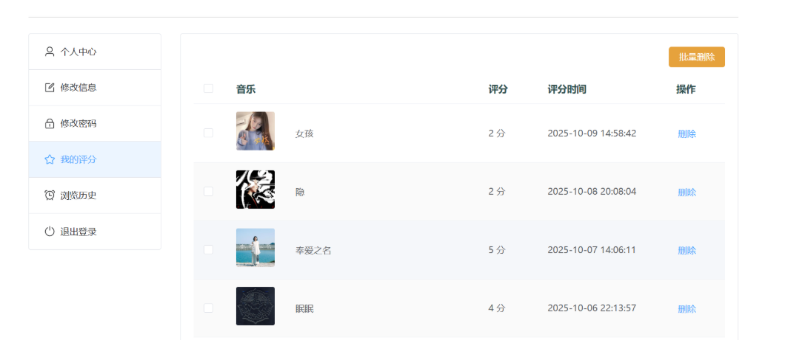
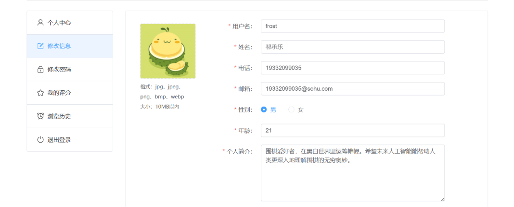

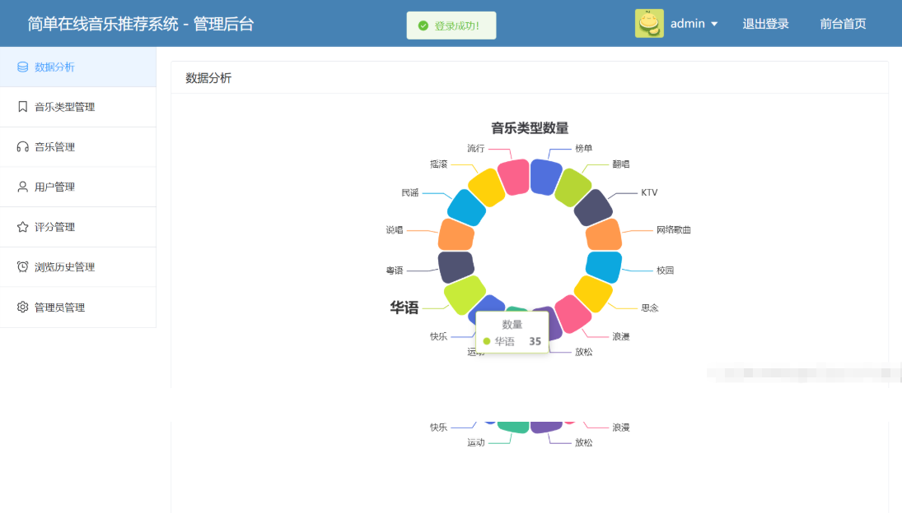
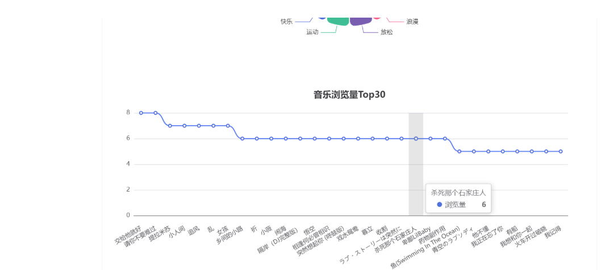
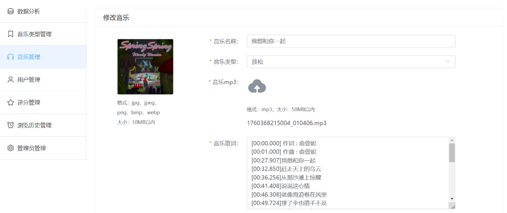
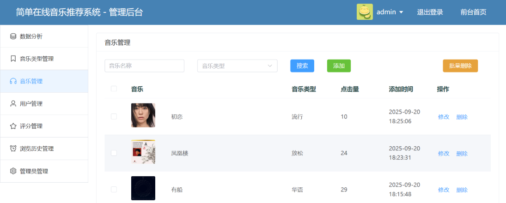
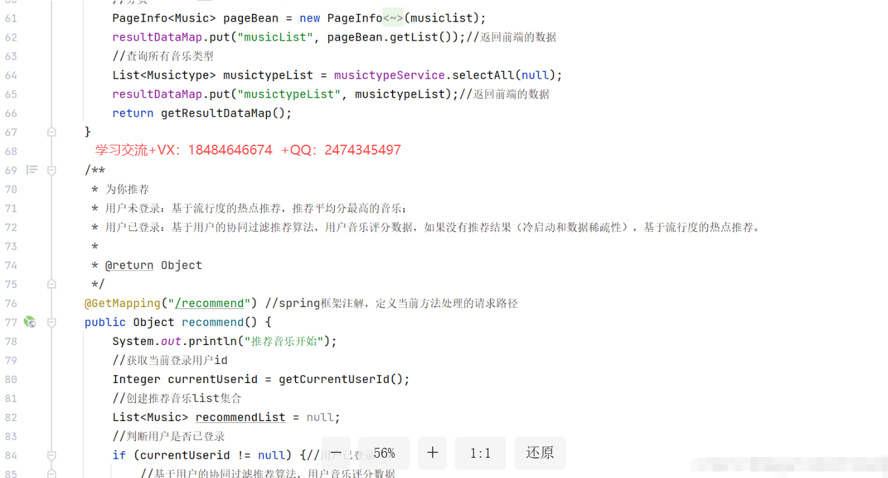